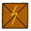
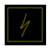
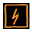
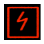
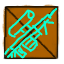
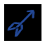
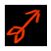
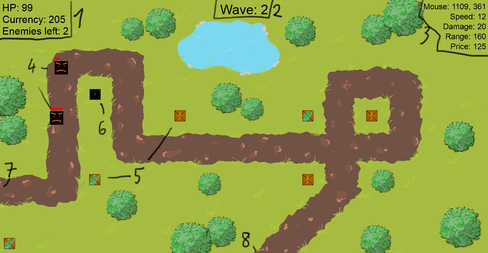

# RTD

Welcome to the RTD! A tower defense game made solely with C and [SDL2.0](https://www.libsdl.org/).
In this game you must defend your territory from waves of enemies by upgrading your towers.
This game was created as a school project and was tested to run in a Linux VM with Ubuntu installed.

## Setting up the game (Building the project)

1. Download the source code and files (assets, include, src and cmakelists.txt)
2. Install the required dependencies:
    ```bash
    sudo apt install libsdl2-dev libsdl2-image-dev libsdl2-ttf-dev libsdl2-mixer-dev
    ```
3. Use cmake to build the game by running cmake in the project directory:
    ```bash
    cd build/
    cmake ..
    cmake --build .
    ```

## How to Play

1. Start the game:
    ```bash
    ./RTD
    ```
    or
    Opening the RTD file in some systems
2. You can hover over turrets to see how much they cost and their stats
3. Buy initial towers by clicking on them while having enough money
4. Earn currency by defeating enemies to upgrade your towers and improve your defenses (upgrade costs are also shown when you hover over a tower).
5. Survive 30 waves to reach the endless mode and win!

## Gameplay info

A fast shooting turret with low damage but with a low price tag.  
   

A slow shooting turret with high damage and longer range but much higher price.  
   

All turrets can be upgraded forever after reaching their max level for a slight stat increase.

## Visual description of gameplay

1. HUD with HP current money to buy turrets and ammount of enemies left on the map in the current wave
2. Wave counter showing the current wave
3. HUD with mouse position (usefull if you wanna see how far your turret can shoot!), it's RoF (Rate of Fire aka how fast it shoots), its damage, range and price to buy/upgrade
4. Enemies
5. Unbought towers avaible to buy
6. A bought turret shooting at enemies
7. A spawn point which the enemies come from
8. Endpoint where if enemies reach this place you lose hp

## Regarding audio in the game
As an important note, none of the sfx are included in the GitHub repo due to copyright reasons as they were used as raw .wav files. 
If you're curious, the sounds used by the full project were made by [Ovani Sound](https://ovanisound.com/).

## Credits
- SFX assets in the full project [Ovani Sound](https://ovanisound.com/)
- Background asset [foxkathy](https://www.instagram.com/foxkathy_)
- Rest is my creations.

## Warning if you wanna use the code
When starting i've had 0 experience with [SDL](https://www.libsdl.org/) and i usually used a high-level language (C#, python etc) plus i haven't ever made a game without using a game engine for it, so implementations may be deemed extremally nonsensical by someone with enough experience, but at last the code should not contain any memory leaks hopefully and i've tested to go to 100+ waves by turning the "gameover" system off and didn't experience a problem when testing.
